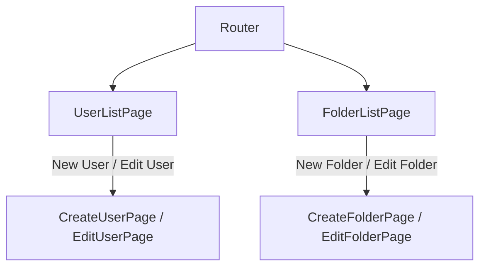

# Detailed Implementation Plan for User Administration UI

This document outlines a detailed step-by-step plan to implement the User Administration UI in React. The components will use the neon design system and integrate real API calls via the `BFFApi` construct defined in `src/cdk/lib/main-stack.ts`. The UI you generate should follow the flow below closely, taking user interface best practices into account, but always using react components and CSS classes from the neon design system (which are documented in the file package-docs/neon-design-system-examples.xml) rather than creating your own. You should also use `new_task` so that each component is generated in its own task, passing the necessary information for the tasks to generate the components.

---

## File Structure & Components

All React component files will be placed in the `ui/src/app/pages` directory. The following files will be created:

- **UserListPage.tsx**  
  Displays a list of users in a neon-styled table. Includes a header that:

  - Highlights the "Users" menu item (non-clickable).
  - Contains a clickable "Folders" menu item for navigation.

- **CreateUserPage.tsx**  
  A form for creating a new user. Features:

  - **Fields:**
    - Username (text input; required)
    - Authentication Type (dropdown with options "Password" and "SSH key"; required)
      - **Conditional Popup:**
        - If "Password" is selected: Trigger a popup for cryptographically secure password generation.
          - Options: Choose length (minimum 10), toggle pronounceable mode (constructs two-letter consonant/vowel pairs).
          - Display generated password abbreviated (first 2 & last 2 characters shown with dashes in between).
          - Actions: Accept or regenerate.
        - If "SSH key" is selected: Trigger a popup for RSA public key input.
          - Validate to ensure the key is a public key (reject if it appears to be a private key).
          - Display redacted version (e.g., three stars) after saving.
    - Access (pulldown with options "read", "write", "readwrite"; required)
    - Product Code (dropdown populated via an API call to fetch available products; required)
    - Folders (multi-select populated based on chosen product, at least one must be selected; required)
    - IP Whitelist (textarea for entering IP addresses or CIDR ranges; optional)
  - **Buttons:**
    - "Save": Triggers API call to create the user.
    - "Cancel": Returns to User List page with a refresh.

- **EditUserPage.tsx**  
  Similar to CreateUserPage, but:

  - Pre-populates form fields using data fetched from the selected user's record.
  - "Save" button calls the API to update user details.
  - "Cancel" navigates back to the User List page.

- **FolderListPage.tsx**  
  Displays a list of folders in a neon-styled table. The header includes:

  - Clickable "Users" menu item (navigates to the User List).
  - Highlighted "Folders" menu item (non-clickable).
  - Data is fetched via the list folders API.

- **CreateFolderPage.tsx**  
  A form for creating a folder with the following:

  - **Fields:**
    - Product Code (dropdown; required; populated from API call)
    - Use (pulldown; fetched from get product API depending on the product; required)
    - Directory (text input for folder path; required)
    - Access (dropdown with "inbound" or "outbound"; required)
  - **Buttons:**
    - "Save": Calls the folder creation API.
    - "Cancel": Returns to Folder List page with a refresh.

- **EditFolderPage.tsx**  
  Essentially the same as CreateFolderPage, but:
  - Pre-populates form fields with the folder’s data.
  - "Save" updates the folder via an API call.
  - "Cancel" navigates back to Folder List page.

---

## Component Implementation Details

### Common Elements

- **Header & Navigation:**  
  Create a shared header component (or inline in each page) that utilizes neon design system components. The header must:

  - Render two menu items ("Users" and "Folders").
  - Set an active state for the current page.
  - Utilize router links for navigation.

- **API Integration:**

  - Import and use the `BFFApi` methods for fetching data:
    - Users: `listUsers`, `createUser`, `updateUser`
    - Folders: `listFolders`, `createFolder`, `updateFolder`
    - Products: API call to fetch product list and use options.
  - Use React hooks (`useEffect`, `useState`) to manage data fetching, loading states, and error handling.
  - Ensure no mock data is used, only real API calls.

- **Styling:**

  - All tables should use the class `__neon__table-simple` as defined in the neon design system.
  - Use neon components for forms, buttons, modals/popup dialogs, and dropdowns as per examples in `package-docs/neon-design-system-examples.xml`.

- **Conditional UI Logic for Authentication Type:**
  - On the Create/Edit User pages, add state management to detect the selected authentication type.
  - Render a modal whenever "Password" or "SSH key" is selected.
  - Implement validation and regeneration logic within the modal.

### Detailed Component Workflow

#### UserListPage.tsx

1. **Initialization**
   - Import necessary React hooks, neon UI components, and BFFApi utilities.
2. **Data Fetching**
   - On component mount (`useEffect`), call the API to retrieve users.
   - Store data into state.
3. **Rendering**
   - Render header with the “Users” active.
   - Render neon-styled table to display user details.
   - Provide "Edit" and "Inactivate" actions as table buttons.
   - Provide a "New User" button linking to CreateUserPage.

#### CreateUserPage.tsx & EditUserPage.tsx

1. **Initialization & Form Setup**
   - Define state for form fields and modal visibility.
   - For EditUserPage, fetch existing user data on mount.
2. **Field Components**
   - Render input field for username.
   - Render dropdown for authentication type; attach onChange handlers to update state.
   - Based on authentication type selection, conditionally render a modal:
     - **Password Modal:**
       - Include options for length and pronounceable toggle.
       - Display generated password and options to accept or regenerate.
     - **SSH Key Modal:**
       - Render a text area for key input, including error message handling.
   - Render pulldown for access.
   - Render product Code dropdown; fetch options via API.
   - Based on the selected product, fetch and display available folders in a multi-select input.
   - Render textarea for IP whitelist.
3. **Buttons & Submission**
   - "Save" button: On click, validate fields and call the create or update API respectively.
   - "Cancel" button: Return to the User List page.

#### FolderListPage.tsx

1. **Initialization**
   - Use `useEffect` to fetch folder data from API on mount.
2. **Rendering**
   - Render header with navigational links (Users active link clickable).
   - Render the neon-styled table listing folder details.
   - Include an "Edit" button for each folder entry.
   - Provide a "New Folder" button that routes to CreateFolderPage.

#### CreateFolderPage.tsx & EditFolderPage.tsx

1. **Initialization & Form Setup**
   - Define state for form fields.
   - For EditFolderPage, fetch folder data on mount.
2. **Field Components**
   - Render pulldown for product code using API data.
   - Render pulldown for "use", which is dependent on product selection.
   - Render a text input for the directory path.
   - Render pulldown for access mode.
3. **Buttons & Submission**
   - "Save" button: Validate inputs and call the appropriate API.
   - "Cancel" button: Navigate back to the Folder List page.

---

## Example Mermaid Flow Diagram

---

## Additional Considerations

- **Error Handling & Loading States:**  
  Implement basic error handling using state to display messages in case API calls fail.  
  Use loading indicators while data is being fetched.

- **Code Reusability:**  
  Explore creating common components (e.g., Header, Modal, FormField) to avoid duplication.

- **Routing Integration:**  
  Ensure that the React Router is configured so that navigation among pages is seamless.

- **Testing:**  
  Write unit tests (e.g., using Jest and React Testing Library) to ensure each component functions correctly.

---

## Next Steps for Code Mode

This detailed plan can now be handed off to code mode for implementation. It includes:

- Creating individual component files under `ui/src/app/pages`.
- Implementing the described API integrations.
- Adding the conditional logic for authentication modals in user forms.
- Following the neon design system guidelines for UI consistency.
