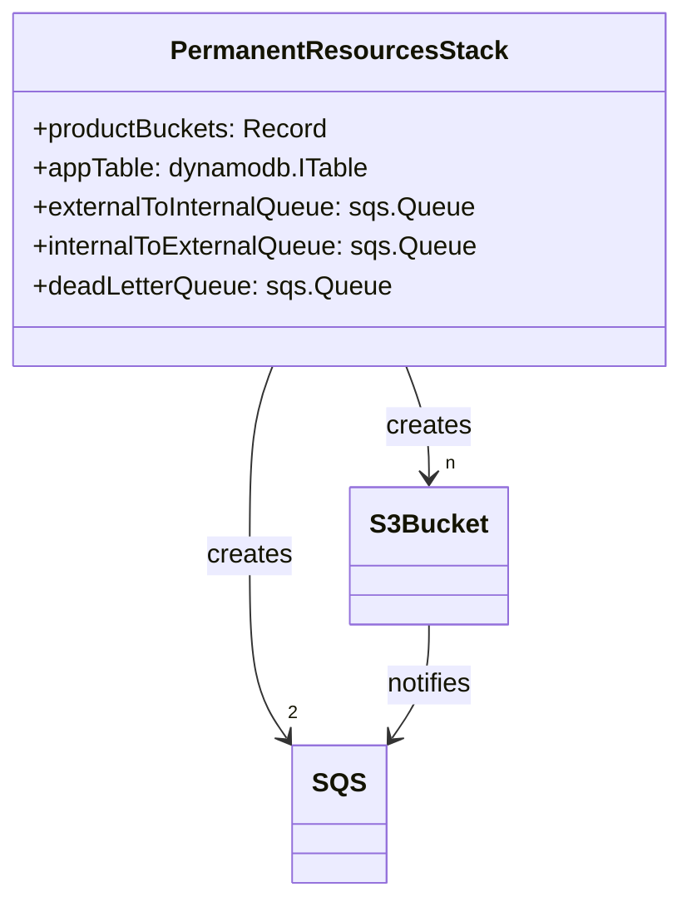
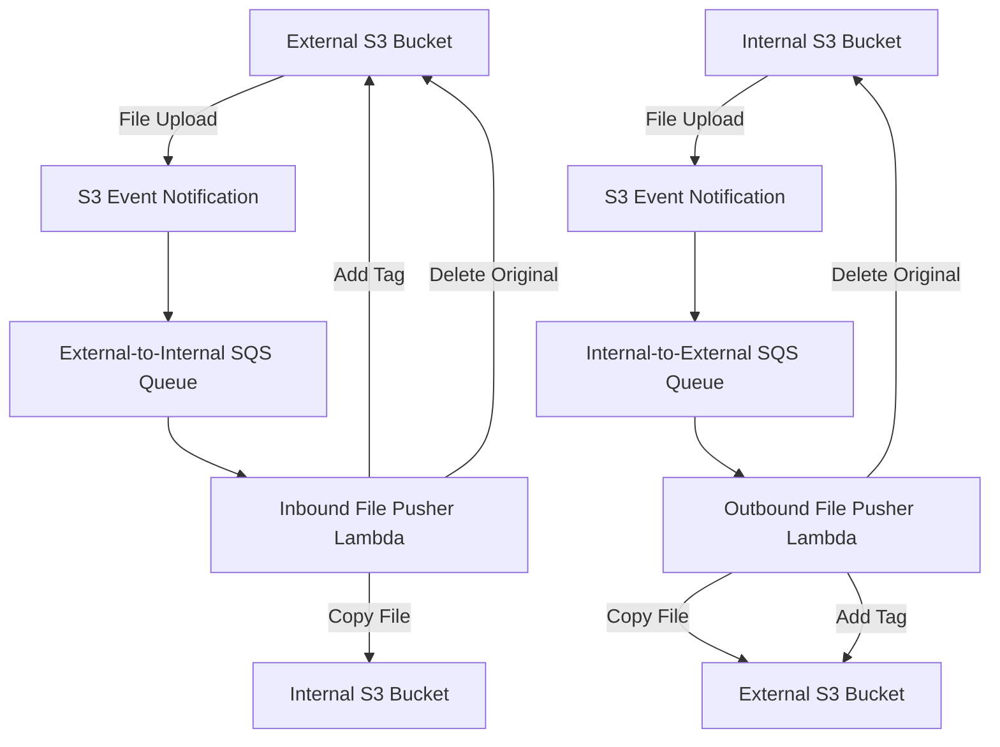

# Implementation Plan for CLNST-6976: File Pusher Lambda

After reviewing the Jira ticket and examining the codebase, I've developed a comprehensive plan to implement the File Pusher Lambda functionality. This feature will enable automatic file movement between external and internal SFTP system S3 buckets, with additional security features like EXIF data removal. All code will be written in TypeScript to maintain consistency with the existing codebase.

## Current Understanding

The PowerSchoolFTP application currently:

- Creates internal and external S3 buckets for each product in the `PermanentResourcesStack`
- Has a Transfer Family SFTP server set up in the `MainStack`
- Provides user authentication and management through API Gateway and Lambda functions
- Has basic S3 utility functions for managing user home directories

## Implementation Requirements

Based on the Jira ticket CLNST-6976, we need to:

1. Create SQS queues for notifications when files are created in S3 buckets
2. Implement Lambda functions to move files between internal and external buckets
3. Add appropriate tagging to files to prevent infinite loops
4. Handle both inbound (external → internal) and outbound (internal → external) file transfers
5. Remove EXIF metadata from image files for enhanced privacy
6. Implement a dead-letter queue for handling failed transfers

## Detailed Implementation Plan

### 1. Update PermanentResourcesStack

First, we'll modify the `PermanentResourcesStack` to add the required SQS queues and S3 event notifications:

#### Changes:

- Create three SQS queues:
  - `externalToInternalQueue`: For processing files uploaded to external buckets
  - `internalToExternalQueue`: For processing files uploaded to internal buckets
  - `deadLetterQueue`: For handling failed transfer attempts
- Configure S3 event notifications on all product buckets to send events to the appropriate queue
- Export the queue ARNs and URLs as CloudFormation outputs

### 2. Create File Pusher Lambda Functions

Next, we'll implement two Lambda functions to handle the file movement:

#### Lambda Functions:

1. **Inbound File Pusher Lambda**:

   - Triggered by the external-to-internal SQS queue
   - Checks if the file has the "direction" tag with value "outgoing" (if yes, skip processing)
   - For image files, removes EXIF metadata to enhance privacy
   - Copies the processed file from the external bucket to the internal bucket with the same key
   - Adds the "direction" tag with value "incoming" to the file in the external bucket
   - Deletes the original file from the external bucket upon successful copy
   - Sends failed transfers to the dead-letter queue for later processing

2. **Outbound File Pusher Lambda**:
   - Triggered by the internal-to-external SQS queue
   - Checks if the file has the "direction" tag with value "incoming" (if yes, skip processing)
   - For image files, ensures EXIF metadata is removed
   - Copies the file from the internal bucket to the external bucket with the same key
   - Adds the "direction" tag with value "outgoing" to the file in the external bucket
   - Deletes the original file from the internal bucket upon successful copy
   - Sends failed transfers to the dead-letter queue for later processing

### 3. Update MainStack

We'll update the `MainStack` to:

- Reference the SQS queues created in the `PermanentResourcesStack`
- Create the Lambda functions with appropriate permissions
- Configure the Lambda functions to be triggered by the SQS queues

### 4. Create S3 Utility Functions

We'll extend the existing `s3-utils.ts` file to add utility functions for:

- Copying files between buckets
- Adding tags to S3 objects
- Deleting S3 objects
- Parsing S3 event notifications from SQS messages
- EXIF metadata removal for image files
- Error handling and dead-letter queue integration

### 5. Testing

We'll create comprehensive tests for:

- Unit tests for the Lambda functions
- Integration tests to verify the end-to-end file movement process
- Tests for edge cases like handling large files, error conditions, etc.

## Implementation Steps

1. **Update PermanentResourcesStack**:

   - Add SQS queues (including dead-letter queue) and S3 event notifications
   - Update exports and references

2. **Create S3 Utility Functions**:

   - Extend `s3-utils.ts` with new functions for file operations
   - Add EXIF metadata removal for image files
   - Add error handling with dead-letter queue integration

3. **Implement Lambda Functions**:

   - Create `inbound-file-pusher-handler.ts` and `outbound-file-pusher-handler.ts` in TypeScript
   - Implement the file movement logic with proper error handling
   - Integrate EXIF removal into the workflow

4. **Update MainStack**:

   - Add Lambda function definitions
   - Configure SQS triggers
   - Set up appropriate IAM permissions

5. **Write Tests**:

   - Unit tests for Lambda handlers
   - Integration tests for the complete workflow

6. **Documentation**:
   - Update README with information about the new functionality
   - Add comments to code explaining the file movement process

## Considerations and Potential Challenges

1. **Performance**:

   - For large files, we may need to consider using multipart uploads
   - We should implement proper error handling and retries

2. **Security**:

   - Ensure proper IAM permissions are set up
   - Consider encryption requirements for data in transit and at rest

3. **Error Handling**:

   - Implement comprehensive error handling in all Lambda functions
   - Use the dead-letter queue for failed transfers to allow for retry or manual intervention
   - Log detailed error information for troubleshooting

4. **Cost Optimization**:

   - Configure appropriate Lambda timeout and memory settings
   - Consider batch processing of SQS messages

5. **EXIF Data Removal**:

   - Implement a solution to detect and process image files
   - Use a library like ExifTool or similar functionality to strip EXIF metadata
   - Ensure the process is efficient and doesn't significantly impact performance

6. **TypeScript Implementation**:
   - Ensure all code is written in TypeScript
   - Follow existing project coding standards and patterns
   - Use strong typing for all interfaces and functions

## Questions

Before proceeding with the implementation, I have a few remaining questions to clarify:

1. Should we implement any file size limits or other validation on the files being transferred?
2. Are there specific file types that should be prioritized for EXIF removal?
3. Are there any compliance requirements we need to consider for the file processing?
4. Should we implement any specific retry logic for failed transfers in the dead-letter queue?
